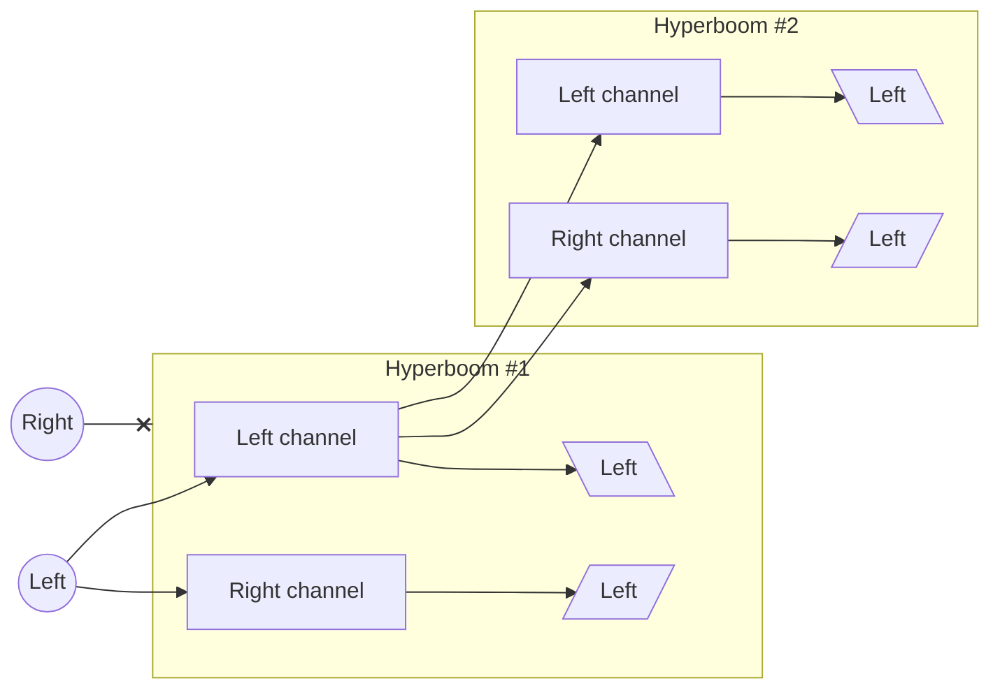
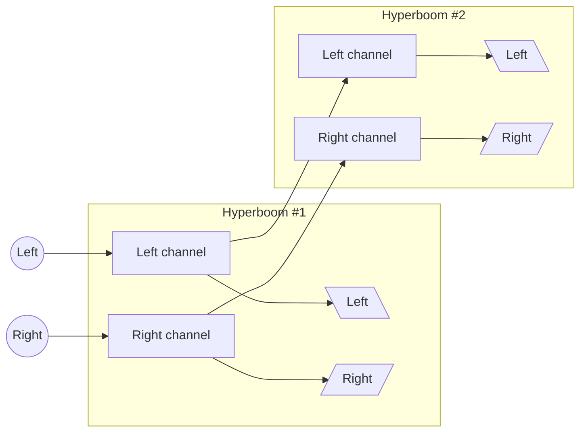
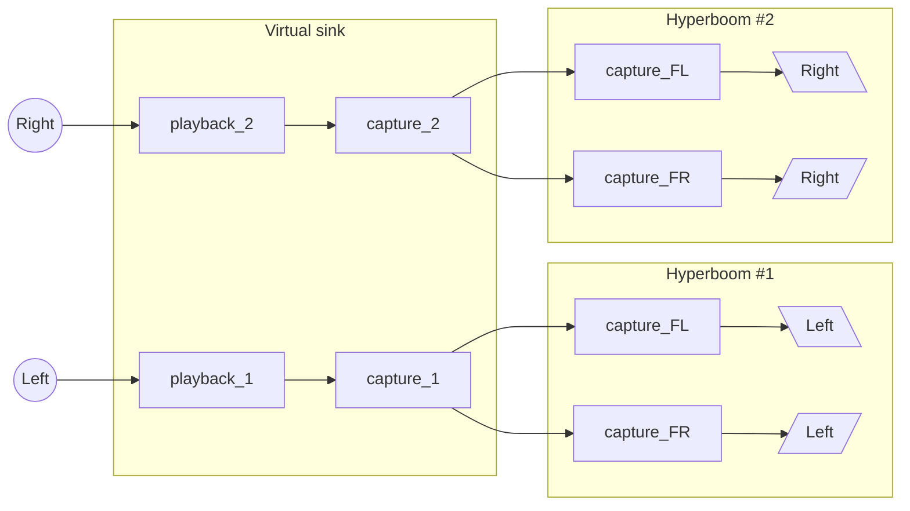

# HyperBoom Duo Stereo Script

This script enables stereo playback using two Ultimate Ears HyperBoom Bluetooth
speakers on a Linux Debian 12 system. It mimics the "Party Up" feature of the
Ultimate Ears mobile application, creating a virtual device for synchronized
playback.

## Features

- Combine two HyperBoom speakers for stereo sound.
- Utilizes PipeWire and PipeWire-Pulse for virtual device management.
- Supports custom speaker identification via their human-readable names.

## Requirements

- Linux Debian 12 (or a compatible distribution).
- Installed dependencies:
  - pipewire
  - pipewire-pulse
- Two paired and connected Ultimate Ears HyperBoom speakers.

## Setup and Configuration

1. Ensure both speakers are paired and connected via Bluetooth.
2. Set the speakers to the same volume.
3. Edit the script to configure the following variables:
   - Virtual device name and description:
     ```
     VIRTUAL_SINK_NAME="HyperBoom_Left"
     VIRTUAL_SINK_DESCRIPTION="HyperBoom_Right"
     ```
   - Speaker Names: Set the human-readable names of your two HyperBoom speakers.
     These names should match their Bluetooth device names.
     ```
     LEFT_SPEAKER="HyperBoom_Left"
     RIGHT_SPEAKER="HyperBoom_Right"
     ```
4. Save the changes to the script file.

## Usage

1. Make the script executable:
   ```
   chmod +x hyperboom-duo-stereo.bash
   ```
2. Run the script:
   ```
   ./hyperboom-duo-stereo.bash
   ```
3. Follow any on-screen instructions to finalize the setup.

The script does not make permanent changes, thus you have to execute it every
time Pipewire is restarted.

## Troubleshooting

### Everyday troubles

- Ensure both speakers are powered on, paired, and connected before running the
  script.
- Verify that pipewire and pipewire-pulse are installed and running on your
  system.
- Check the human-readable names of your speakers using the Bluetooth settings
  or tools like bluetoothctl.

### Synchronization problems

On my system, there were synchronization problems occuring quite regularly. The
following tip helped me solve them.

The following instructions were taken from [Low latency guide for Linux using Pipewire (on Reddit)](https://www.reddit.com/r/linux_gaming/comments/1gao420/low_latency_guide_for_linux_using_pipewire)

Create/edit `~/.config/pipewire/pipewire-pulse.conf` and put the following lines
into it:

    context.modules = [
        { name = libpipewire-module-rt
            args = {
                nice.level = -20
                rt.prio = 99
            }
            flags = [ ifexists nofail ]
        }
        { name = libpipewire-module-protocol-native }
        { name = libpipewire-module-client-node }
        { name = libpipewire-module-adapter }
        { name = libpipewire-module-metadata }

        { name = libpipewire-module-protocol-pulse
            args = {
            }
        }
    ]

    pulse.properties = {
        server.address = [
            "unix:native"
        ]
        pulse.min.req      = 32/48000
        pulse.default.req  = 32/48000
        pulse.min.quantum  = 32/48000
        pulse.idle.timeout = 16
        vm.overrides = {
            pulse.min.quantum = 1024/48000
        }
    }

Restarting Pipewire

```shell
systemctl --user restart wireplumber pipewire pipewire-pulse
```

## License

This script is distributed under the GNU GPL3 License. See the LICENSE file for
more details.

## Why this script?

Inspired by the "Party Up" feature of the Ultimate Ears mobile application, this
script brings similar functionality to Linux users.

It is possible to use the Party Up under Linux with the following steps:

1. on your smartphone, place the two speakers in Party Up using the Ultimate Ears
   application.
2. under Linux, connect to the main speakers (the one which does not have a full
   circle illuminated).
3. set the main speakers to use the Bluetooth channel used by Linux.
4. Done!

One problem is to be forced to use the application.

But the **main problem** is that the Party Up mode does not work correctly for
my two Hyperboom speakers. It seems to be buggy in stereo mode.

### How my two Hyperboom speakers work when in Party Up *stereo* mode

When using Party Up stereo mode on my two Hyperboom speakers, only one channel
is used, making it a mono mode which ignores one channel.



### How my two Hyperboom speakers work when in Party Up *duo* mode

The Party Up duo mode is not really helpful to use my Hyperboom speakers as a
stereo set.



### What this script does

